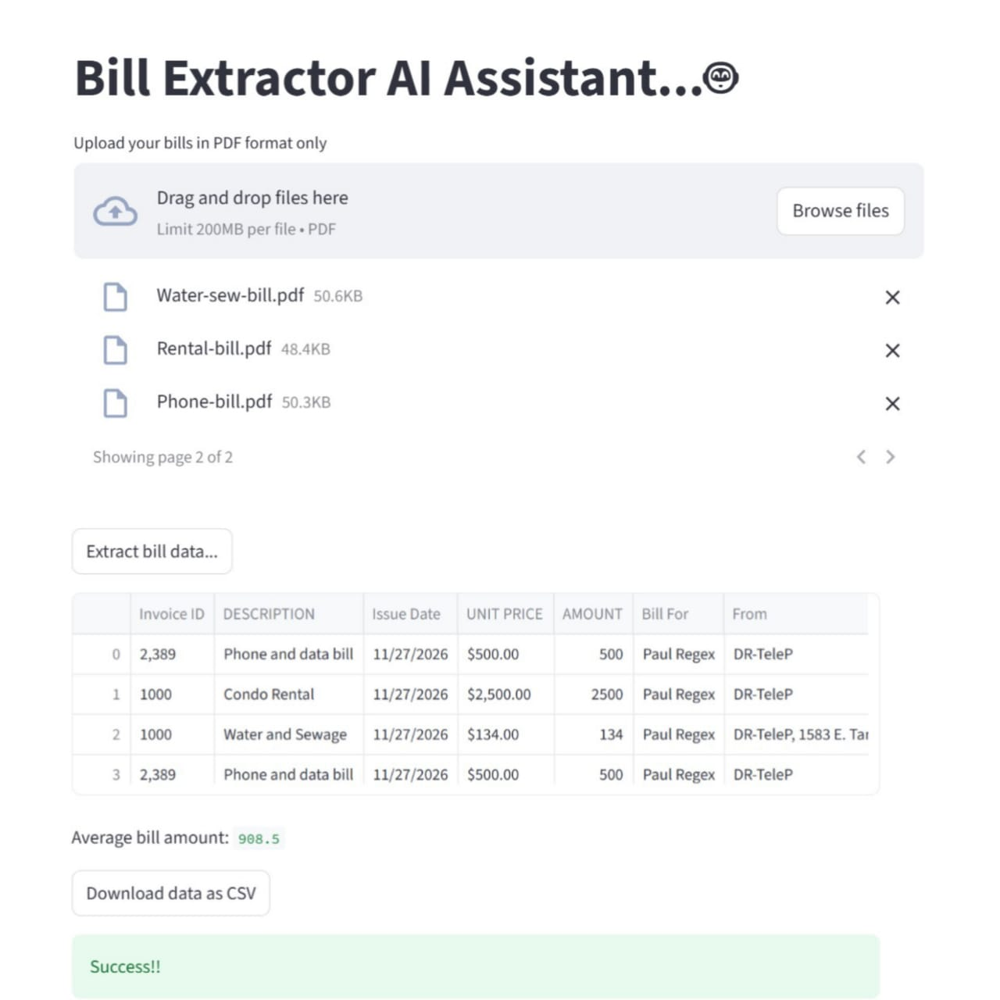

# Bill Extractor AI Assistant

**Description**:
This project leverages the power of AI to extract and process invoice data from PDF files. The Bill Extractor AI Assistant utilizes Groq's model to extract key invoice details such as Invoice ID, Description, Issue Date, Unit Price, Amount, Bill For, From, and Terms. It processes uploaded PDF files and returns the extracted data in a structured format, which can be easily analyzed or exported as a CSV file.

**Features**:

* Upload multiple PDF invoices at once.
* Extract key invoice data: Invoice ID, DESCRIPTION, Issue Date, UNIT PRICE, AMOUNT, Bill For, From, Terms.
* Clean data and handle different formats.
* Export extracted data to a CSV file.
* View the average bill amount.

**Tech Stack**:

* Python
* Streamlit
* Groq AI Model (for data extraction)
* Langchain (for LLM integration)
* OpenAI
* Pandas
* PDF parsing (PyPDF2, BytesIO)

**How to Use**:

1. Clone this repository.

   ```bash
   git clone https://github.com/yourusername/bill-extractor.git
   ```
2. Create a `.env` file and add your `GROQ_API_KEY` for API authentication.
3. Run the Streamlit app:

   ```bash
   streamlit run app.py
   ```
4. Upload PDF files of your invoices and click "Extract bill data..." to process them.
5. After extraction, the data will be shown, and you can download the extracted data as a CSV file.

**Folder Structure**:

```
bill-extractor/
├── app.py                    # Streamlit app to upload and process invoices
├── helper.py                 # Helper functions for data extraction and processing
├── .env                      # Environment variables for API keys
└── README.md                 # Project overview and setup guide
```

**Screenshot of Output**:
Here’s a screenshot of how the extracted data looks in the app:



**Deployment**:
You can deploy this app on platforms like [Heroku](https://www.heroku.com/) or [Streamlit Sharing](https://streamlit.io/sharing) for cloud-based access.


---

This format is clean and covers all necessary aspects to help others understand, install, and contribute to the project. Adjust the repository link and other relevant parts as necessary!
